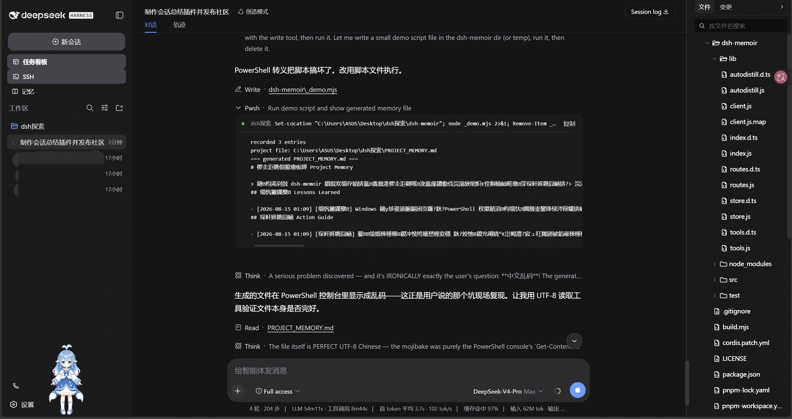
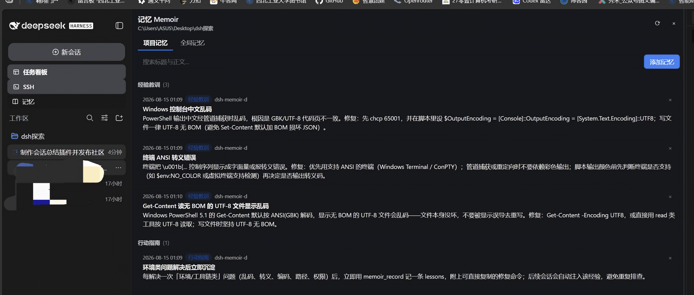
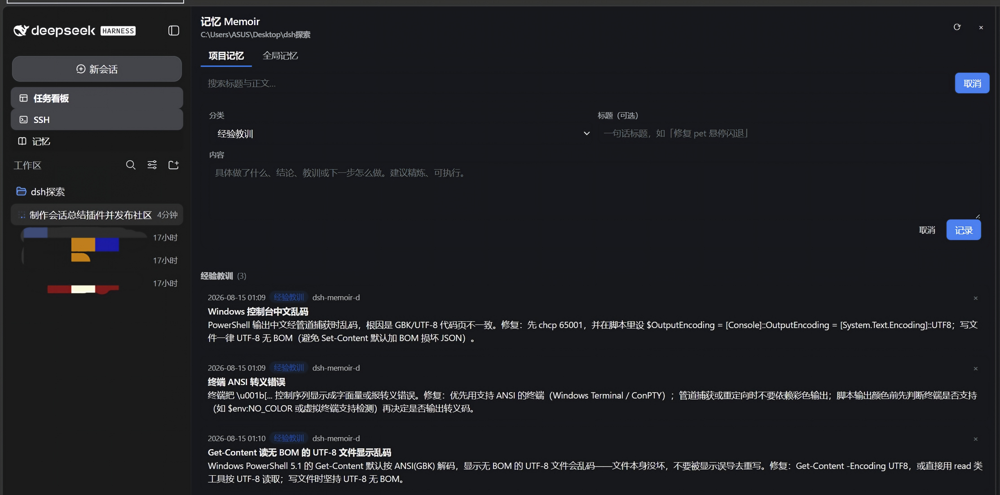
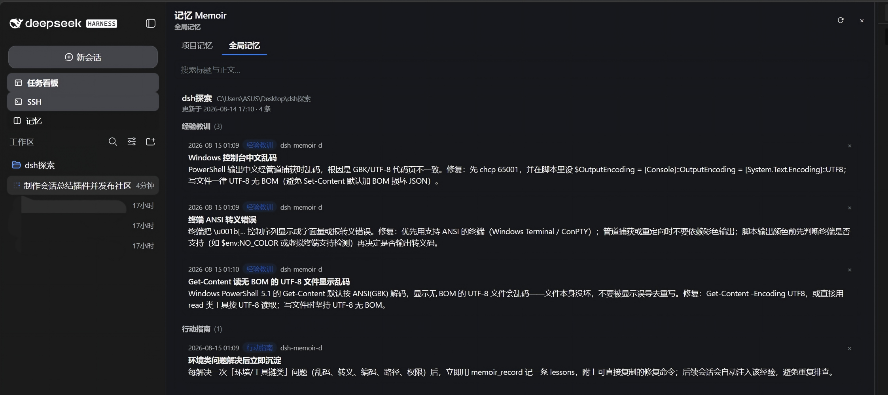

# dsh-memoir

[](https://www.npmjs.com/package/dsh-memoir)

[中文](./README.md) · English · [Changelog](./CHANGELOG.md) · [GitHub Releases](https://github.com/Qinling-Melon-Farmers/dsh-memoir/releases)

**dsh-memoir is a local project-memory layer for DeepSeek Harness: it persists an agent's work conclusions, lessons learned, and next actions, then carries them across sessions through bounded Hot Memory injection, on-demand ranked recall, and Web GUI management.**

> Cache-aware local project memory for DeepSeek Harness.

- **Local-only** — all data stays on your machine (`~/.dsh/dsh-memoir.json` + per-project `PROJECT_MEMORY.md`)
- **Zero external memory service** — no vector database, no embedding API, no cloud memory service
- **Bounded hot-memory injection** — token-budgeted Hot Memory is injected into the system prompt (default 900/1200)
- **Ranked local recall** — inverted index + BM25 local ranked retrieval; `memoir_read` fetches long-tail history on demand
- **Web GUI** — a sidebar "Memory" panel with project/global browsing, relevance-ranked search, Hot Memory Inspector, and Retrieval Diagnostics

## Quick Start

```bash
# install into the web profile from npm (recommended)
dsh plugin --profile web add dsh-memoir

# or install latest source from GitHub
dsh plugin --profile web add github:Qinling-Melon-Farmers/dsh-memoir

# or local development (after cloning)
dsh plugin --profile web add link:/absolute/path/dsh-memoir
```

Restart DSH to take effect (`dsh web`), then use it normally:

```text
use the Agent as usual
      ↓
end of each worked turn: an automatic distill reminder
      ↓
memoir_record persists work / lessons / next steps
      ↓
future sessions auto-inherit Hot Memory (bounded, ranked, frozen per session)
      ↓
need long-tail history? memoir_read (local relevance-ranked recall)
```

## Architecture

```text
                   ~/.dsh/dsh-memoir.json
                            │
                            │ SSOT (single source of truth)
                            ▼
                      MemoirStore
              ┌─────────────┴─────────────┐
              │                           │
              ▼                           ▼
        PROJECT_MEMORY.md          Retrieval Index
         human-readable             ranked recall
         (git-committable)                │
              │                           ▼
              │                       memoir_read
              │                       GUI /search
              │
              ▼
       Hot Memory Selector
         (token budget)
              │
              ▼
       Session Snapshot
         (frozen per session)
              │
              ▼
         System Prompt
```

## Memory Model: Full Memory vs Hot Memory

**Full Memory (complete history)** — the structured JSON SSOT plus the regenerated `PROJECT_MEMORY.md` projection. Used for: complete history, GUI browsing, git commits, manual inspection, and as the source data for ranked recall.

**Hot Memory (bounded injection)** — high-value memories selected by the selector within a token budget, injected into the system prompt. Properties: **bounded / ranked / compact / session-frozen**.

> v0.4+ no longer injects the full PROJECT_MEMORY.md into the model: Hot Memory goes to the prompt, long-tail history goes through ranked recall.

**Session Snapshot freezing semantics**: one session's injected text is built once and frozen (stable prompt prefix, maximizing prompt-prefix cache hits); the current session does not re-consume memory it just wrote, and a new session rebuilds and sees the latest memory. Since v0.4.2, when there is no unique session identity (session.id / agent.id), freezing is skipped — a cache miss beats wrongly reusing another session's snapshot.

## v0.5.0 lifecycle and rc8 compatibility

- The development and peer-dependency baseline is `@deepseek-ai/dsh-* 0.1.0-rc.8`.
- Store format v3 migrates v2 entries without changing their `id`, content, or timestamp. The first mutation materializes `importance`, `pinned`, `status`, `supersedes`, and `tags`; startup reads do not rewrite old files.
- Retrieval defaults to `active`. Archived and superseded history is retained and can be inspected from the Web panel. Explicit `supersedes` marks its targets as superseded; history is never deleted automatically.
- Agents can use `memoir_update` to edit an entry's section, title, content, and lifecycle in place; the Web panel also supports editing, pinning, marking superseded, archiving, and restoring.
- `PROJECT_MEMORY.md` is a human-readable projection. Only bounded Hot Memory enters the system prompt; the full file is not injected.
- GET routes no longer register browser-supplied paths as active workspaces. Only the trusted system-prompt cwd grants panel write authorization. Lock metadata now includes pid, creation time, and nonce, with conservative reclaim only after 60 seconds and a dead owner.
- `memoir_read(scope: 'all')` uses a deduplicated global ranking so project and global results are not repeated.

## Tools

| Tool | Purpose |
| --- | --- |
| `memoir_record` | write work / lessons / actions / note entries |
| `memoir_update` | edit an existing entry while preserving its id and creation time; update content, tags, lifecycle, or explicitly supersede history |
| `memoir_read` | local relevance retrieval across project (default) / global / all, with limit and compact/full output shapes |

`memoir_read`'s query description matches its real behavior: **local relevance retrieval over titles and content — supports Chinese phrases, English keywords, code identifiers, and paths, ordered by relevance**.

## Retrieval

- No embeddings, no vector database, no external memory service
- Tokenization: Chinese 2/3-grams + English words + code/path identifiers
- BM25 (documents keep true term frequency; queries are deduplicated)
- 2.5× title boost, exact-phrase boost, section weight, recency decay
- Separate length normalization for titles and bodies (v0.4.2)
- Epoch-aware LRU query cache with 1-hour time buckets: limit/detail stay out of the cache key, so every output shape shares one ranked result (v0.4.2)
- Query-cache metrics (hits/misses/evictions/hit rate) and Last Query (latency/candidates/returned) observability (v0.4.2)
- Global recall limit is a true global Top-K; output truncation preserves the top-ranked head (v0.4.2)

Curated-query Top-5 hit rate: 100% (quality gate ≥ 90%, see `test/recall-quality.test.ts`).

## GUI

The v0.4 Project / Global / Search / Add / Delete / Diagnostics architecture is kept; since v0.4.2:

- **Search unified on RetrievalEngine**: a non-empty query calls `GET /api/dsh-memoir/search` — the same BM25 ranking as the agent's `memoir_read` — results ordered by relevance with scores shown
- **Hot Memory Inspector**: expand to see the Hot Memory that will actually be injected for the current workspace (Actions / Lessons / Recent state) — i.e. "what exactly the next session inherits"
- **Retrieval Diagnostics**: Retrieval Index (docs/terms/epoch), Query Cache (hits/misses/evictions/hit rate/size/capacity), Last Query (latency/returned), Session Snapshot (hash/createdAt/storeRevision)

## Screenshots

**1. Plugin active & overall UI**: the sidebar gains a "Memory" entry (alongside SSH / Task Board, mutually exclusive panels); clicking opens the memory panel in the center column.



**2. Project memory**: the current project session's persistent memory grouped into Work Log / Lessons Learned / Action Guide / Notes; each entry shows time, section chip, title, content, and session origin, with search, refresh, and per-entry delete.



**3. Manually adding memory**: a form to pick a section, a one-line title, and content — written to the same data the agent's `memoir_record` writes; PROJECT_MEMORY.md regenerates automatically after submit.



**4. Global memory management**: memory buckets for all projects (name, path, updated time, count) with cross-project search and per-entry maintenance.



**5. Ranked search + Hot Memory Inspector + Memory Diagnostics (v0.4.2)**: a typed query triggers RetrievalEngine-ranked recall with a relevance score on each result; at the bottom you can expand the Hot Memory Inspector (what the next session will inherit for the current workspace) and the extended Memory Diagnostics (Retrieval index / Query cache / Last query / Session snapshot).


## Storage & Privacy

```text
~/.dsh/dsh-memoir.json        ← structured JSON (single source of truth / SSOT)
<workspace>/PROJECT_MEMORY.md ← human-readable projection regenerated from the JSON (git-friendly)

No cloud memory DB · No embedding API · No vector DB
```

JSON is the source of truth and Markdown is the generated projection: the panel, the tools, and the agent write the same data. Since v0.4.2 the panel write API is also workspace-authorized — an absolute path submitted by the browser is not authorization by itself; only the current active cwd or an existing store project can be written to.

## Configuration

Add a `config` block on the plugin row in `cordis.patch.yml` (all optional; defaults shown):

```yaml
- insert:
    - id: memoir
      name: dsh-memoir
      config:
        enabled: true            # master switch (tools, routes, prompt section)
        announceToAgent: true    # system-prompt announcement section
        autoDistill: true        # auto distill reminder after each worked turn
        hotMemoryTokens: 900     # Hot Memory target tokens
        hotMemoryMaxTokens: 1200 # Hot Memory hard ceiling (never exceeded)
        readDefaultLimit: 8      # memoir_read default result count
        readMaxLimit: 30         # memoir_read maximum result count
        sessionSnapshotMax: 128  # per-session snapshot LRU cap
        queryCacheSize: 128      # ranked-query LRU cache size
```

## Design Trade-offs

- **Bounded vs full injection**: v0.3 injected the full history into the prompt and it kept growing; v0.4+ injects only budgeted Hot Memory, with long-tail history recalled on demand. Token benchmarks below.
- **Frozen vs fresh**: within a session the injected text is frozen to gain prompt-prefix cache hits; without a unique session identity it is not frozen (v0.4.2), so new sessions always see new memory.
- **Hot Memory quota**: Recent state (newest work, 1–3 entries) is guaranteed a floor, actions/lessons fill by ranking, and work only appears in Recent state — never injected twice (v0.4.2).
- **Multi-process safety**: store record/remove runs inside a cross-process critical section on `~/.dsh/dsh-memoir.lock` (exclusive O_EXCL creation with timeout); the section force-reloads from disk before mutating, so two interleaved DSH processes lose no updates (v0.4.2).
- **Windows paths**: canonical keys are fully lowercased (`C:\A` / `c:\a\` / `C:/A` share one bucket) while display paths keep the original casing (v0.4.2).
- **GUI and Agent share one engine**: panel search and `memoir_read` use the same RetrievalEngine instead of separate filter logic (v0.4.2).

## Use Cases

| Scenario | How to use it |
| --- | --- |
| Recurring environment pitfalls (encoding / escaping / paths / permissions) | record a `lessons` entry with copy-pasteable fix commands |
| Project rules and conventions (no emoji, run tests before release, branch policy) | record as `actions`, auto-injected for whoever takes over |
| Root cause of a hard-to-find bug | record as `lessons` / `work` to avoid re-investigation |
| Fixed deployment/release checklist | record as `actions`; new sessions follow it |
| Reuse experience across projects | global tab or `memoir_read(scope: 'global', query: ...)` |

Typical example: after solving "console Chinese mojibake" the first time, record the diagnosis and fix commands as a `lessons` entry (e.g. `chcp 65001 first … always write UTF-8 without BOM`); every new session in this project then inherits the lesson automatically instead of re-debugging, and cross-project global search hits it too. The memory plugin distills "root cause + fix command" into project knowledge — it does not fix the terminal's own encoding defects.

## Comparison

| Project | Primary focus |
| --- | --- |
| dsh-memory | citation / source-traceable reference memory |
| dsh-mnemon | a heavier long-term memory system |
| distill | distilling sessions into skills |
| **dsh-memoir** | **lightweight project workflow memory: local, bounded injection, ranked recall** |

Each plugin has its own focus — pick per need; no "which is stronger" narrative.

## Development / Benchmark / Tests

```bash
pnpm install          # install devDeps (typescript, esbuild, @deepseek-ai/* type packages)
pnpm run build        # tsc builds the host + esbuild builds the client bundle
pnpm run typecheck    # full type check (src + test)
pnpm test             # 141 tests: store (incl. multi-process lock) / snapshot / selector / retrieval / tools / routes / auto-distill / integration / client pure logic / bundle protocol & purity
npm run bench         # benchmark (100/1k/10k/100k entries); results written to bench/report.md
```

Quality gates: **Top-5 recall ≥ 90% · Hot Memory ≤ configured hardMax · same-session prompt-prefix stability · global recall ≤ limit · zero lost updates across processes**.

v0.4.2 benchmark summary (node v22.23.2, budget 900/1200 tokens; full report in `bench/report.md`. Methodology fixed: uncached queries measure `search()` directly; cached queries warm the same query first, then time it):

| Entries | Cold load | Warm read | Hot Memory build | Index build | Uncached query | Cached query | Cache hit rate | Full markdown tokens | Injected tokens | Reduction |
|---|---|---|---|---|---|---|---|---|---|---|
| 100 | 1.3 ms | 2.22 µs | 0.54 ms | 2.9 ms | 0.224 ms | 2.87 µs | 50.0% | 3870 | 902 | 76.7% |
| 1,000 | 1.6 ms | 0.40 µs | 0.70 ms | 15.0 ms | 1.419 ms | 1.45 µs | 50.0% | 38182 | 916 | 97.6% |
| 10,000 | 25.3 ms | 0.42 µs | 2.60 ms | 142.9 ms | 11.889 ms | 1.14 µs | 50.0% | 385807 | 902 | 99.8% |
| 100,000 | 158.2 ms | 0.42 µs | 31.97 ms | 2238.7 ms | 153.551 ms | 1.15 µs | 50.0% | 3907057 | 917 | 100.0% |

## Implementation

- **Full-stack TypeScript**: `src/host/*.ts` (store / tools / retrieval / selector / snapshot / routes / autodistill / index — tsc emits `lib/*.js`) + `src/client/*.ts(x)` (esbuild emits the `lib/client.js` closure-factory bundle).
- **Two-sided plugin**: the host half registers the agent tools, `/api/dsh-memoir` routes, the `agent/turn-stopping` auto-distill listener, and the per-project system-prompt injection section; the client half renders the panel. Runtime deps are official NPM SDK packages only.
- Mounted via the `dsh.bundle.patch` manifest (`insert` row in `cordis.patch.yml`); no DSH source changes.
- Auto-distill safety boundaries: top-level sessions only (subagents / nested delegations skipped), turns with tool activity that haven't recorded yet, aborted turns skipped, at most one steer per turn.

## Contributing

PRs and issues are managed with templates and automation:

- [CONTRIBUTING.md](CONTRIBUTING.md) — PR scope, commit conventions and checklist;
- [ISSUE_TRIAGE.md](ISSUE_TRIAGE.md) — issue labels, classification and closing criteria;
- `.github/ISSUE_TEMPLATE` — bug / request templates; `.github/pull_request_template.md` — PR template.

Bug reports must include screenshot / log evidence, a smoke test, code references and a patch. New features and documentation-only PRs must first be discussed in an issue.

## Release

Current stable release: **v0.5.0** (2026-08-20) · [GitHub Release](https://github.com/Qinling-Melon-Farmers/dsh-memoir/releases/tag/v0.5.0) · [npm](https://www.npmjs.com/package/dsh-memoir/v/0.5.0). Full history is in [CHANGELOG.md](./CHANGELOG.md).

Version releases run automatically in `.github/workflows/publish.yml` when a `v*` tag is pushed: install deps, verify the tag matches the `package.json` version, run typecheck/test, publish to npm, then create a same-tag GitHub Release with the tarball asset. Configure either of these auth options in the repo:

- npm Trusted Publishing: GitHub repo `Qinling-Melon-Farmers/dsh-memoir`, workflow `publish.yml`
- GitHub Actions secret `NPM_TOKEN`: a granular token with publish rights and 2FA bypass allowed

Publishing a patch release:

```bash
npm version patch
git push
git push origin vX.Y.Z  # use the actual version printed by npm version
```

`npm version patch` updates `package.json`, creates the version commit and the tag; no manual `git tag` or local `npm publish` needed.

## License

Apache-2.0
